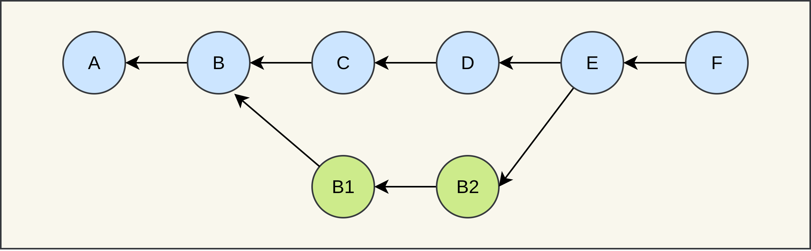
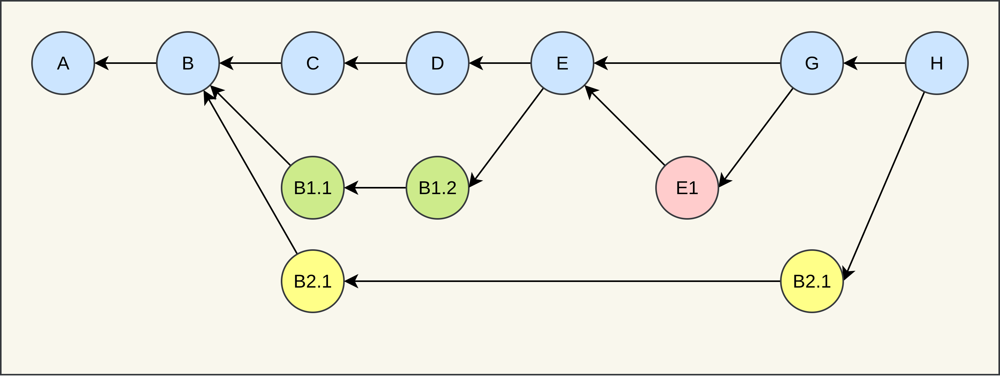

<!-- _class: lead -->

# Software Engineering

## Sven Eppler
  

---

<!-- _class: chapter -->

# Versionskontrollsysteme

## Wer macht hier eigentlich was?

---
# Versionskontrollsysteme (VCS)

Erfüllen diese grundliegenden Aufgaben:
- Erfassen aller Änderungen am Quellcode ("Change Management"):
    - Was hat sich geändert?
    - Wer hat was geändert?
    - Wann hat sich was geändert?
- Vereinfacht die Kollaboration mehrerer Autoren
- Reproduzierbares Wiederherstellen alter Versionen

---

# Zentrale vs. Dezentrale Versionskontrolle

VCS Systeme können grob in diese zwei Gruppen eingeteilt werden

- Zentral (Subversion, Team Foundation Server, CVS)
    - Single-Source-Of-Truth auf zentralem Server
    - Änderungen müssen an eine Zentrale Instanz geschickt werden
    - Ständiges Synchronisieren zwischen Teilnehmern
    - Verbindung zum zentralen Server erforderlich

---

# Zentrale vs. Dezentrale Versionskontrolle

- Dezentral (Mercurial, BitKeeper, Git)
    - Kein Single-Source-Of-Truth
    - Kompletter Klon bei jedem Entwickler
    - Änderungen können komplett unabhängig eingepflegt werden
    - Verbindung zum Server/andere Teilnehmer nur notwendig wenn synchronisiert werden soll
---

# Was ist git?

- Ein VCS entwickelt von Linus Torvalds zum Verwalten des Linux Kernels
- Es gehört zu der Gruppe der dezentralen VCS
- Leichtgewichtige Implementirung mithilfe von Dateien und sog. Symlinks
- Abbildung der Vergangenheit als "gerichteter azyklischer Graph"

---

# Installation

- Linux: Einach aus dem lokalen Repository installieren. Z.B. `sudo apt install git`
- Windows:
    - Git for windows: https://git-scm.com/download/win
    - NICHT EMPFOHLEN: TortoiseGit
- MacOS: Einfach git im Terminal eingeben, MacOS bietet die Installation dann an Siehe "Installation unter macOS" unter https://git-scm.com/book/de/v2/Erste-Schritte-Git-installieren

---

<!-- _class: chapter -->

# Grundbegriffe

## Damit wir alle über das Gleiche reden

---

# Grundbegriffe: Version

Jeder Zwischenstand der in das Versionskontrollsystem eingetragen wird ist für das VCS eine Version. Diese Versionen werden z.B. mit "Revisionsnummern" oder einem Hash beschrieben.

Abgrenzung zu Software-Releases: Beschreibt einen konkreten Zustand einer Software. Wird typischerweise über einen Versionsstring angegeben `v1.2.3`.

---

# Grundbegriffe: Working Copy

Die "Working-Copy" ist für Git die aktuell "ausgecheckte" Version mit der gearbeitet wird.

Da bei Git "alles nur Dateien" sind, sind in einem Repository auch immer alle Versionen vorhanden. Lediglich eine Version kann als "Working-Copy" aktuell editiert werden.

"dirty" Working Copy: Eine konkrete Version wurde ausgecheckt danach aber verändert. Diese Änderungen sind aber noch nicht "comitted" worden. (z.T. auch "untracked changes" genannt)

---

# Grundbegriffe: Commit

Ein "Commit" erfasst Änderungen an der "Working-Copy" und fügt diese Änderungen zur "Versionsgeschichte" hinzu.

Ein Commit besteht im Wesentlichen aus:

 - Commit-Beschreibung
 - Autor
 - Zeitstempel
 - Zeiger auf den Vorgänger-Commit
 - Die gemachten Änderungen

---

 # Grundbegriffe: Commit

Diese Informationen werden mit dem SHA-1/256 Verfahren gehasht. Der resultierende Hash wird als sog. "Commit-Hash" bzw. "Commit-Id" bezeichnet. Mit diesem Hash ist jeder Commit in einem Repository eindeutig indentifizierbar.

Mehrere Commits bilden durch den Zeiger auf ihre Vorgänger einen gerichteten azyklischen Graphen (DAG).

**Wichtig**: Fügt man zu einem Repository einen Commit hinzu, existiert dieser Commit zunächst lediglich im _lokalen_ Klon des Repository.

Fun Fact: Das ist im wesentlichen eine Blockchain ohne Proof-of-Work.

---

# Grundbegriffe: Commit (DAG)

---

# Grundbegriffe: Clone / Checkout

Unter einem "Clone" versteht man bei Git eine lokale Kopie eines entfernt gehosteten Git-Repositorys (z.B. bei GitHub). Ein "Clone" ist im wesentlichen genau das: Es ist eine 1:1 Kopie des gesamten Repositories mit allen Versionen.

Innerhalb des "Clone" kann sich der Entwickler auf dem lokalen System frei bewegen. D.h. er kann jede Version "auschecken", verändern und neu "einchecken". Damit verändert er zunächst aber nur den eigenen "Clone".

Bei einem "Checkout" wechselt der Benutzer auf dem lokalen System zwischen verschiedenen Versionen des lokalen Repositorys. Dadurch ändert sich i.d.R. auch die "Working-Copy".

---

# Grundbegriffe: History

Die Commits in einem Git-Repository erzeugen die sog. "History", also die Vergangenheit. Da ein einzelner Commit immer nur die Veränderung zu seinem Vorgänger enthält, muss für eine vollständige Wiederherstellung einer Version immer die komplette History vom gewünschten Zeitpunkt bis zum Ursprung "initialer Commit" durchgegangen werden.

Rewriting-History: Einige Git-Bfehle sind in der Lage, die Vergangenheit eines Git-Repositories zu ändern (z.B. git rebase). Diese Befehle erzeugen einen "History-Rewrite". Für unbedarfte Nutzer sollten solche Rewrites vermieden werden.

---

# Grundbegriffe: Branch
Ein "Branch" bezeichnet das Konzept einer "Abzweigung" innerhalb des DAG. Dabei kann man sich die Folge der Git-Commits wie einen Baum vorstellen.

Es können mehrere Branches parallel laufen, dadurch ermöglicht Git eine hohe Parallelisierung der Entwicklung innerhalb des Repositories.

Jeder Branch hat einen "Usprungs-Commit" ab dem der Branch vom bestehenden Hauptbranch abzweigt.

---
# Grundbegriffe: Branch

Unterschiedliche Branches können den selben "Usprungs-Commit" haben.

Auf einem Branch werden dann Commits hinzugefügt. Zu einem späteren Zeitpunkt kann der Branch dann wieder mit dem Hauptzweig zusammen geführt werden.

Ein Branch hat einen Namen über den er identifziert werden kann. Besonderheit: Der Name zeigt automatisch immer auf den neusten Commit auf einem Branch.

---

# Grundbegriffe: Branch

## Ein Branch

---

# Grundbegriffe: Branch

## Viele Branches

---

# Remote

Ein "Remote" beschreibt in git ein entferntes Git-Repository. Zu diesen remote Repositories kann mit speziellen Befehlen (`push`, `fetch`, `pull`) Verbindung aufgenommen werden und es können entsprechend Commits ausgetauscht werden.

Das Konzept von Remote- und Local-Repository sorgt häufig für Verwirrung. Grundsätzlich findet in Git keine automatische Synchronisierung zwischen lokalen und entfernten Repositories statt. Diese Synchronisation muss manuell mit Hilfe der passenden Begriffe (`push`, `pull`, `fetch`) durchgeführt werden!

---

# Zentrales Remote

---

# Dezentrale Remotes

---

<!-- _class: chapter -->

# Wichtige Git Kommandos
## Wie man git benutzt

---

# Wichtige Git Kommandos
## Einleitung

- Git selber ist ein reines Command Line Interface (CLI) Tool ohne grafische Oberfläche.
- Gesteuert wird es über spezielle Befehle.
- Es empfiehlt sich vor der Verwendung eines grafischen Tools mit den Grundbefehlen auf dem Terminal auseinander zu setzen.
- Unter Windows am besten mit der "git bash".

---

# Wichtige Git Kommandos
## Hilfe

- Jedes Kommando kann mit --help aufgerufen werden, um eine umfassende Erklärung zu erhalten.
- Eine umfassende Einleitung/Erklärung von git und den Befehlen liefert das [Git book](https://git-scm.com/book/de/v2).

---

# Wichtige Git Kommandos
## init

- Mit `git init` wird ein neues Git-Repository im aktuellem Verzeichnis angelegt.
- Dabei ist egal, ob das Verzeichnis bereits Code enthält oder leer ist.
- `git init` in einem bereits existierenden Git-Repository re-initialisiert das Repository, dabei gehen keine Informationen verloren.

---

# Wichtige Git Kommandos
## clone
- Mit `git clone $remoteUrl` kann ein entferntes Repository (z.B. GitHub) lokal geklont werden.
- Git unterstützt dabei zwei Protokolle: HTTP(S) und SSH.
  `git clone https://github.com/ghandmann/vorlesung-software-engineering.git`
  `git clone git@github.com:ghandmann/vorlesung-software-engineering.git`
  - HTTPS wird typischerweise nur noch für read-only clones genutzt

---

# Wichtige Git Kommandos
## status
- Mit `git status` kann vor und nach Aktionen immer eine aktuelle Übersicht über das Repository erzeugt werden.
- Git liefert hier meist auch schon nützliche weitere Kommandos für die nächsten Schritte.
- Wenn man nicht genau weiß, in welchem Zustand das Repository ist, einfach `git status` eintippen.

---

# Wichtige Git Kommandos
## add
- Mit `git add $fileName` können Dateien zum Repository hinzugefügt werden.
- Durch den `add`-Befehl werden Änderung zunächst nur in die sog. _staging area_ abgelegt. Das ist eine Art "Wartezimmer" um alle Änderungen zusammen zu tragen um diese dann in einem Commit tatsächlich fest ins Repository zu integrieren.
- Hat man Dateien mit dem `add`-Befehl hinzugefügt, kann man mit `git status` eine Auflistung erhalten, welche Dateien "staged" sind und welche "unstaged" sind.

---

# Wichtige Git Kommandos
## rm
- Mit `git rm` können Dateien aus dem Repository gelöscht werden.
- Mit `git rm --cached $fileName` kann eine Datei aus der staging area entfernt werden, d.H. sie wird nicht mehr zum commit vorgemerkt.
---

# Wichtige Git Kommandos
## commit
- Mit `git commit` wird aus den Änderungen die im "staging" bereich sind ein commit erzeugt.
- Achtung: Der Befehl startet den Standardeditor auf ihrem System damit Sie für den commit eine Beschreibung eingeben können. Unter linux wird dies durch die `$EDITOR` Umgebungsvariable gesteuert. Der Mechnismus unter Windows ist mir leider nicht bekannt.
- Mit der Option `-m` kann direkt eine sog. "Commit-Message" angegeben werden: `git commit -m "Meine Commit-Beschreibung"`, dann startet auch kein Editor.

---

# Wichtige Git Kommandos
## log
- Mit `git log` kann man sich die Commit-History ansehen. Standardmäßig listet der Befehle die History vom aktuell ausgecheckten Commit zurück bis zum Ursprungs-Commit auf
- Mit `git log $commithash` kann der Startpunkt der History geändert werden, so kann die History ab einem bestimmten Commit angesehen werden.
- Hier kann man auch Branch-Namen verwenden, z.B. `git log main`, dadurch kann man auch bequem auf "andere" Branches schauen ohne vorher mit `switch`/`checkout` auf den Branch wechseln zu müssen.

---

# Wichtige Git Kommandos
## diff

- Mit `git diff` kann man sich die Unterschiede zwischen der aktuellen Working-Copy und der ausgecheckten Version anschauen.
- Dabei kommt ein spezielles Diff-Format zum Einsatz das zum Teil nicht leicht zu interpretieren ist.
- Mit `git diff -- $filename` kann man sich den Diff einer bestimmten Datei anzeigen.
- Mit `git diff $OldRevision $NewRevision` kann man sich den Unterschied zweier Versionen im Repository ansehen.
- Mit `git diff --cached` kann man sich der Unterschied von Dateien die im "staging" mode sind ansehen.
- Mit `git difftool` kann ein diff auch mit einem GUI Tool wie z.B. Meld angezeigt werden.

---

# Wichtige Git Kommandos
## restore

- Mit `git restore $filename` werden alle Änderungen an dieser Datei in der aktuellen Working-Copy rückgängig gemacht.
  **WICHTIG** Diese Operation zerstört die Änderungen, diese können nicht wiederhergestellt werden - denn die Änderungen an der Working-Copy waren noch nicht "committed".
- Mit `git restore .` machen Sie alle Änderungen in allen Unterverzeichnissen rückgängig. Es gilt die selbe Warnung wie oben!

---

# Wichtige Git Kommandos
## fetch

- Mit `git fetch` weisen Sie git an, die mit dem Repository verbundenen remote Repositories auf Neuigkeiten zu überprüfen
- Der `fetch`-Befehl verändert niemals ihre Working-Copy, sondern schaut lediglich nach, ob Neuigkeiten vorhanden sind.
- Nach einem `git fetch` ist es oft hilfreich ein `git status` auszführen um Informationen zu bekommen, wie die Neuigkeiten evtl. intergriert werden können.

---

# Wichtige Git Kommandos
## push

- Mit `git push` veröffentlichen Sie die Commits aus Ihrem lokalen Repository in das verbundene Remote-Repository.
- Wenn mehrere Entwickler auf dem selben Branch arbeiten, kann es durchaus sein, dass ihr push Befehl vom Server "rejected" wird, weil auf dem Branch bereits neuere Änderungen vorhanden sind. Häufig können Sie das Problem damm mit `git pull --rebase` und anschließendem `git push` korrigieren.
- Empfehlung: Vermeiden Sie das mehrere Entwickler auf dem selben Branch arbeiten!

---

# Wichtige Git Kommandos
## pull

- Mit `git pull` weisen Sie Git an, Änderungen die es auf dem remote Repository gibt, in ihre lokale Working-Copy zu übernehmen.
- Wenn sich auf ihrem lokalem Branch Commits befinden, die remote nicht existieren, erzeugt `git pull` automatisch einen sog. "Merge-Commit". Dieser sollte anschließend geprüft werden, da hier oft unerwartet Änderungen passieren.
- Um diesen "Merge-Commit" zu vermeiden, empfiehlt sich die Verwendung von `git pull --ff-only`. Dabei werden Änderungen vom remote nur übernommen, wenn es keine Commits gibt, die im Konflikt stehen.

---

# Wichtige Git Kommandos
## switch

- Mit `git switch $branchName` können Sie zwischen verschiedenen Branches wechseln.
- Der Wechsel kann nur durchgeführt werden, wenn ihre Working-Copy sauber ist.

---

# Wichtige Git Kommandos
## checkout

- Mit `git checkout $commitHash` können Sie einen beliebigen Commit aus dem Repository auschecken, d.h. ihre Working-Copy wechselt zu dieser Version.
- Der Wechsel kann nur durchgeführt werden, wenn ihre Working-Copy sauber ist.
- Mit `git checkout -b $newBranchName` können Sie vom aktuellen commit aus einen neuen branch anlegen und diesen direkt auschecken. Dies ist hilfreich um z.B. einen schnellen Bugfix-Branch zu erzeugen.

---

# Wichtige Git Kommandos
## merge (1/2)

- Mit `git merge $branchName` bringen Sie alle Änderungen von `$branchName` auf den aktuell ausgecheckten Branch. Dabei entsteht ein sog. "Merge-Commit".
- Beim mergen von Branches kann es auch zu Konflikten kommen. Dies wird in der Konsole angezeigt und der Merge wird unterbrochen. Sie können dann mit `git status` nachsehen, welche Dateien einen Konflikt haben.
- Sobald Sie die Konflikte aufgelöst haben, müssen die Konfliktdateien mit `git add $filename` als "resolved" markiert werden.

---

# Wichtige Git Kommandos
## merge (2/2)

- Danach kann mit `git merge --continue` der Merge fortgesetzt werden.
- Sollten Sie den Merge aus irgendwelchen Gründen abbrechen wollen, können Sie mit `git merge --abort` den Merge-Vorgang abbrechen. Achtung: Das geht nur, wenn der Merge nicht konfliktfrei durchläuft!
- Mit `git mergetool` kann ein merge auch mit einem GUI Tool wie z.B. `Meld` angezeigt werden.

---

# Gefährliche Befehle
## reset

- Mit `git reset --hard $commitHash` verändern Sie manuell den Zeiger des aktuell ausgecheckten Branches. Dabei gehen möglicherweise Commits für immer verloren!

---
# Gefährliche Befehle
## rebase

- Mit `git rebase $startPoint` verändern Sie für den aktuell ausgecheckten Branch, den Ursprungscommit. Dabei wird die History neu geschrieben. Sofern die History bereits mit `git push` veröffentlicht wurde, sind Sie jetzt im Zustand "diverged".
- D.H. sie können ihren Branch nicht mehr einfach mit `git push` veröffentlichen.

---

<!-- _class: chapter -->

# Besondere Dateien
## Everything is a file

---

# Besondere Dateien
## .git/

Das Verzeichnis `.git/` wird vom Git-Programm gemanaged. Darin enthalten sind alle Konfigurations-Einstellungen für das aktuelle Repository sowie die komplette History aller Commits.

Hier sollten keine Änderungen vorgenommen werden, da sonst das Repository möglicherweise beschädigt wird und Commits verloren gehen könnten.

---

# Besondere Dateien
## .git/config

- Diese Datei enthält einige wichtige Konfigurations-Einstellungen für das Git-Repository.
- Die Datei sollte nicht direkt editiert werden. Sondern über das Kommando `git config` entsprechend verändert werden.

---

# Besondere Dateien
## .gitignore (1/3)

In Software-Projekten finden sich auch immer wieder Dateien, die nicht zum eigentlich Projekt gehören. Oder auch oft Dateien, die sowieso bei jedem Entwickler lokal neu erzeugt werden. Hierzu gehören zum Beispiel:

- Einstellungsdateien der verwendete IDE
- Binärdaten nach dem Kompilieren
- Im Projektordner abgelegte Tools
- Datenbankdateien

---

# Besondere Dateien
## .gitignore (2/3)

Um diese Dateien nicht ständig bei `git status` als "untracked" aufgelistet zu bekommen, kann man solche Dateien in die Datei `.gitignore` eintragen. Git filtert dann alle dort aufgelistet Dateien aus den gängigen Operationen heraus.

Wichtig: Die Datei `.gitignore` sollte ins Repository eingecheckt werden. Wird diese also geändert, muss diese auch mit `git add .gitignore` und `git commit` "committed" werden. Sonst sind die Änderungen nur lokal.

---

# Besondere Dateien
## .gitignore (3/3)

Auf GitHub gibt es eine umfangreiche Sammlung an standard `.gitignore` Dateien für verschiedene Projekte/Programmiersprachen:

- https://github.com/github/gitignore
- Node.JS: https://github.com/github/gitignore/blob/master/Node.gitignore

