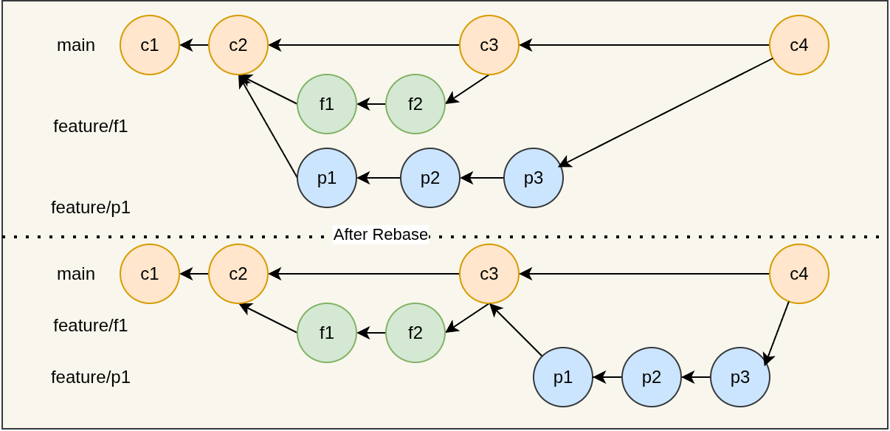

<!-- _class: lead -->

# Workflows mit git und GitHub
## Software Engineering
## Sven Eppler

---

<!-- _class: chapter -->

# Trunk Based Workflow
## Alles auf einen Branch

---

# Trunk Based Workflow

- Idee: Alle Entwickler arbeiten gleichzeitig auf dem selben (Haupt)Branch
- Vorteile:
    - Jeder Entwickler muss jeder Änderung direkt mit allen anderen Änderungen integrieren
    - Der Branch soll dadurch immer "stabil" bleiben
- Nachteile:
    - "Wettrennen" zwischen den Entwicklern: Wer als letztes integriert hat potentiell die meisten Konflikte
- Häufig bei Solo-Entwicklern oder sehr kleinen Teams

---

# Trunk Based Workflow - Single Developer

---

# Trunk Based Workflow - Two Developers

---

# Trunk Based Workflow - Two Developers

Einer muss seine arbeit "umsortieren"

---
<!-- _class: chapter -->

# Feature Branch Workflow
## Ein Branch, ein Job

---

# Feature Branch Workflow

- Idee: Jedes Feature wird isoliert auf einem eigenen Branch entwickelt
- Vorteile:
    - Während der Entwicklung keine Konflikte
    - Fokus auf eine konkrete Aufgabe
- Nachteile:
    - Irgendwann muss wieder integriert werden
    - Konflikte werden unter Umständen nur auf später verschoben
- Hat sich im wesentlichen als Standard durchgesetzt

---

# Feature Branch Workflow

---

# Feature Branch Workflow

- Jeder entwickler erzeugt seine eigenen Branches
- Integration:
    - Via Integrator (vgl. Linux-Kernel mit Linus Torvalds)
    - Via Entwickler selbst
    - Findet aber lokal mit `git merge` statt
- Danach wird der neue `main`-Branch mit `git push` veröffentlicht

---
# Feature Branch Workflow

- **Wichtig:** Da man sich Zeit aus der Zukunft "leiht", sollten Feature Branches kurzlebig (d.H. Stunden bis Tage) sein
- Problem: Die Summe der Änderungen ist erst nach dem Merge auf den Ziel-Branch "sichtbar"

---

# Feature Branch Workflow

- "Lösung" um "big bang merge" zu verhindern:
    - Simple: "Merge Back" vom Ziel-Branch in den Feature-Branch
    - Fortgeschrittene: Rebase, den Branch einfach "nach vorne holen"
---

# Feature Branch Workflow - Merge Back

---

# Feature Branch Workflow - Rebase

---

# GitHub Workflow

- Dabei handelt es sich im wesentlichen um den *Feature Branch Workflow*
- Features/Bugs basieren auf "Issues"
- Feature-Branches werden dann via PullRequest integriert
- Merge findet nicht mehr lokal statt, sondern "im Remote"
- Ermöglicht zusätzliche Schritte:
    - Code Reviews
    - Continious Integration/Continious Deployment
    - Security Scans (`npm audit`, Dependabot, etc.)
- Siehe [GitHub Flow](https://docs.github.com/en/get-started/using-github/github-flow)

---

# GitHub Workflow - Live Demo

* Live Demo Repo: [ghandmann/github-workflow-live-demo](https://github.com/ghandmann/github-workflow-live-demo)

---

# GitHub Workflow - Bonus 
- VS Code im Browser mit `.`-Taste in jedem GitHub Repository
    - Commits können natürlich nur im eigenen/freigegeben Repositories stattfinden
- GitHub Codespaces
- OpenSource Fork-Workflow