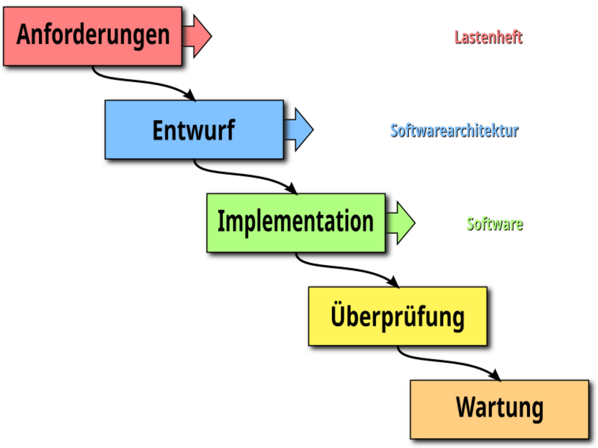
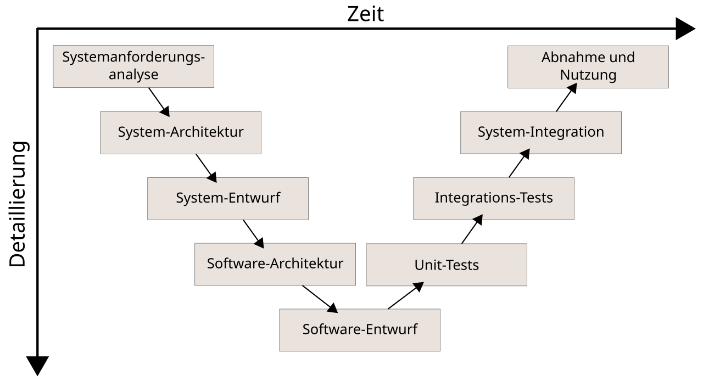
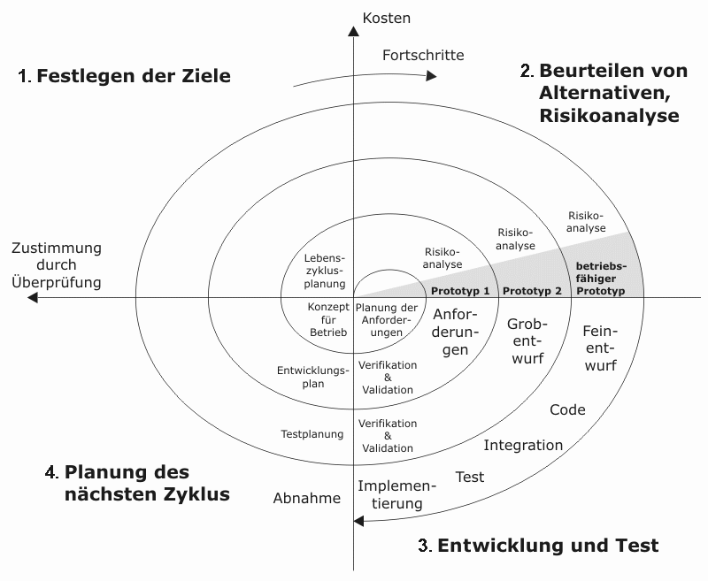

<!-- _class: lead -->

# Software Projektmanagement
## Software Engineering
## Sven Eppler

---
<!-- _class: chapter -->

# Was ist Projektmanagement?
## Ich will doch nur (vibe)coden!

---

# Was macht das Projektmanagement?

- Kommunikation mit dem Auftraggeber
- Treffen von Entscheidungen
- Einhalten von Zeitplänen
- Effizientes und fokusiertes abarbeiten
- Qualitätssicherung
- Risikomanagement
- Kommunikation mit anderen Teams/Abteilungen/Management

---

# Ein guter Projektmanager

- Hohe Kommunikationskompetenz
- Ideal: Technisches Verständnis
- Stellt sich schützen vor das Team/Projekt
- Entscheided strategisch mit Weitblick
- Motivator
- Fit in der jeweiligen Projektmethodik
- Überwacht und steuert

---

<!-- _class: chapter -->

# Klassische Vorgehensmodelle
## Eine Geschichte von Fehlschlägen

---

# Klassische Vorgehensmodelle

- Bewährte Verfahren aus existierenden Branchen
    - Baubranche
    - Herstellende Industrie
    - Management von Personal
- Geeignet für traditionell sequentielle Prozesse mit starren Abhängigkeiten
    - "Das Dach wird einfach nicht vor dem Fundament gebaut"

---

# Wasserfallmodell

---

# Wasserfallmodell

1) Aktivitäten sind in der vorgegebenen Reihenfolge und in der vollen Breite durchzuführen.
1) Am Ende jeder Aktivität steht ein fertiggestelltes Dokument
1) Der Entwicklungsablauf ist sequenziell; d. h. jede Aktivität muss beendet sein, bevor die nächste anfängt.
1) Es orientiert sich am sogenannten Top-down-Verfahren.
1) Es ist einfach und verständlich.
1) Eine Benutzerbeteiligung ist in der Anfangsphase vorgesehen, anschließend erfolgen der Entwurf und die Implementierung ohne Beteiligung des Benutzers bzw. Auftraggebers. Weitere Änderungen stellen danach Neuaufträge dar.

---

# Wasserfallmodell Schwächen

- Abgrenzungsproblem: Klar voneinander abgegrenzte Phasen sind häufig unrealistisch
- Abfolgeproblem: Die einzelnen Phasen laufen in der Theorie nacheinander ab
- Unflexibel gegenüber Änderungen und im Vorgehen
- Frühes Festschreiben der Anforderungen ist oft problematisch
- Einführung des Systems sehr spät nach Beginn des Entwicklungszyklus, deshalb ein später Return on Investment
- Durch die Einführung des vollständigen Systems zu einem bestimmten Zeitpunkt (Big Bang) werden Fehler unter Umständen erst spät erkannt
- Hoher Dokumentationsaufwand

---

# V-Modell

---

# V-Modell
- Weiterentwicklung basierend auf dem Wasserfallmodell für Softwareentwicklung
    - Entsprechend auch Phasengetrieben
    - Starre Abhängigkeiten
    - Späte Kundeneinbindung
    - Starker Fokus auf Test und Integration.
- Vorgehensmodell für IT-Entwicklungsprojekte der Bundesrepublik Deutschland (allerdings stark abgeändert)
---

# V-Modell Schwächen

- Da es sich um eine Weiterentwicklung vom Wasserfallmodell handelt, erbt es auch dessen schwächen
---

# Spiralmodell

---

# Spiralmodell
- Weiterentwicklung des Wasserfallmodells
- Die Phasen des Wasserfallmodells werden iterativ immer wieder durchlaufen
- Dadurch kann im laufe des Projektes immer wieder steuernd eingegriffen werden

---

# Sprialmodell - Schwächen

- Hohe Kosten (insbesondere durch immer wiederkehrende Risikoanalyse)
- Zeitplanung schwierig, da Anzahl iterationen unbekannt
- Risikoanalyse erfordert technische Experten

---
<!-- _class: chapter -->

# Moderne Vorgehensmodelle
## Das muss doch besser gehen?

---

# Das Agile Manifest

- Mit dem [Agilen Manifest](https://agilemanifesto.org/iso/de/manifesto.html) beginnt eine Bewegung die Softwareentwicklungsprozesse neu denkt
- Es baut auf 4 Grundwerten auf:
    1) **Individuen und Interaktionen** mehr als Prozesse und Werkzeuge
    1) **Funktionierende Software** mehr als umfassende Dokumentation
    1) **Zusammenarbeit mit dem Kunden** mehr als Vertragsverhandlung
    1) **Reagieren auf Veränderung** mehr als das Befolgen eines Plans
- Dies baut auf den [12 Prinzipien](https://agilemanifesto.org/iso/de/principles.html) des Agilen Manifestes auf

---

# Extreme Programming
- Methodik die das Lösen eines Problems in den Vordergrund stellt
- Wichtige Praktiken aus XP:
    - Pair-Programming
    - Permanente Integration
    - Refactoring
    - Kundeneinbeziehung
    - Einfaches Design
    - Keine Überstunden
    - Kollektives Eigentum

---

# Extreme Programming - Kritik

- Zu sehr durch die Entwickler selbst getrieben (Kontrollverlust des Management)
- Für unerfahrene Entwickler kann es schwierig sein am Ball zu bleiben
- "Moving Target"-Entwicklung

---

# Scrum

- Baut auf den Werten des agilen Manifestes auf
- Basiert auf Erfolgreichen Projektteams bei Toyota
- Aktuell das erfolgreichste Entwicklungsmodell für Softwareentwicklung
- Findet mittlerweile zunehmend Anwendung außerhalb der Softwareentwicklung

---

# Scrum

- Erweitert das Agile Manifest um konkrete Iterations-Zyklen und weitere Personen:
    - Eine Iteration wird ein Sprint genannt, dieser dauert 2-4 Wochen
    - Ein **Scrum Master** moderiert die Entwicklung
    - Ein **Product Owner** ist Schnittstelle zwischen Team und Auftraggeber
    - Alle bekannten Aufgaben werden in einem **Backlog** lose erfasst
    - Für jeden Sprint werden Aufgaben aus dem **Backlog** in den aktuellen Sprintplan übernommen
    - Ein Sprint gilt unveränderlich
    - In einem **Daily** wird täglich kurz über den aktuellen Stand gesprochen
