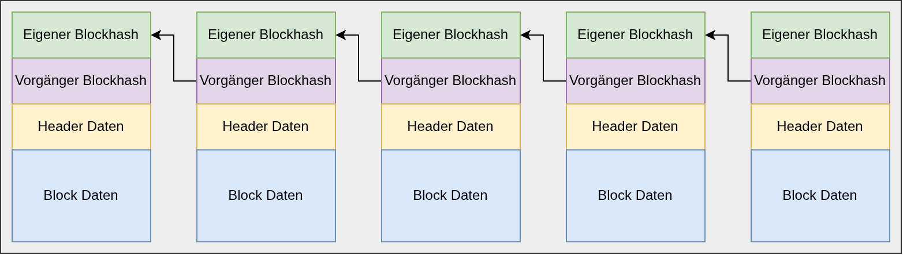
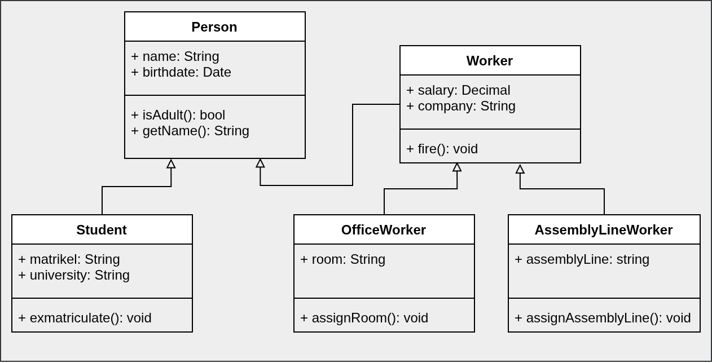
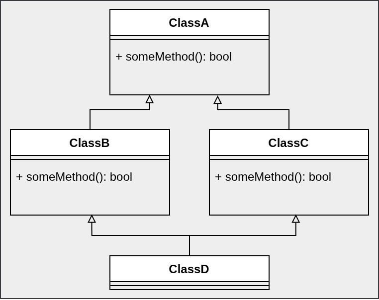

<!-- _class: lead -->

# Programmierparadigmen
## Software Engineering
## Sven Eppler


---

<!-- _class: chapter -->

# Imperative  vs. Deklarative
## Progrmmierung

---

# Imperative Programmierung

- Programmierung in der "Befehlsform"
- Das Programm beschreibt sehr kleinteilig die notwendigen Schritte zum Ziel
    - Vergleiche: Kochrezept
- Klare Reihenfolge wann welche Anweisung kommt
- Der Kontrollfluss wird mithilfe von Kontrollstrukturen gesteuert
    - Bedingungen, Schleifen
- Nicht jedes imperative Programm kann deklarative geschrieben werden
- Beispiele: C, C++, Java, Python, JavaScript

---

# Imperative Prorammierung - Beispiel
Beispielprogramm in C das eine Datei Zeilenweise ausgibt
```c
int main() {
    FILE* datei = fopen("beispiel.txt", "r");
    
    char zeile[1024];
    int zeilennummer = 1;

    while (fgets(zeile, sizeof(zeile), datei) != NULL) {
        printf("%3d: %s", zeilennummer, zeile);
        zeilennummer++;
    }
    
    fclose(datei);
    
    return 0;
}
```

---

# Deklarative Programmierung

- Programmieren in der "Wunschform"
- Das Programm beschreibt das Ziel, nicht den Weg
    - Vergleiche: Ein Foto von einem fertigen Essen
- Der "Weg" wird durch den Computer erzeugt (i.d.R. der Compiler)
    - Ermöglicht dem Compiler diverse Optimierungen, Umsortieren und Parallelisierung
- Verbreitet im wissenschaftlichen Umfeld
    - Zum Teil mathematisch beweisbar das ein Programm korrekt ist
- Jedes deklarative Programm kann auch imperativ geschrieben werden
- Beispiele: Lisp, Haskell, Prolog, SQL

---

# Deklarative Programmierung - Beispiel
Abfragen von Daten mithilfe von SQL:
```sql
SELECT * FROM users WHERE age > 18;
```

Quicksort Algorithmus in Haskell
```haskell
quicksort [] = []
quicksort (x:xs) = quicksort [n | n<-xs, n<x] ++ [x] ++ quicksort [n | n<-xs, n>=x]
```

---
<!-- _class: chapter -->

# Mutablility vs. Immutability
## Veränderbar oder nicht Veränderbar,<br/>dass ist hier die Frage!
---

# Mutablility vs. Immutability

- Mutable-Datastructures sind veränderbar
    - Werte werden "in-place" verändert
    - Seiteneffektbehaftet

- Immutable-Datastructures sind unveränderbar
    - Werte werden nie geändert
    - Bei Veränderung wird ein neuer Wert/Objekt zurück gegeben
    - Seiteneffekfrei

---

# Mutability

- Als "mutable" werden Datenstrukturen bezeichnet, die geändert werden können
- Die Änderunge geschieht "in-place" und "global" für alle, die eine Referenz auf den Wert haben
- Problem: Seiteneffekte
    - Änderungen an der einen Stelle des Programms kann zu Fehlern an einer ganz andere Stelle führen
- Wird häufig "umgangen" z.B. in C++ mit `const std::string&`
    - Alternativ muss Synchronisiert werden (z.B. `mutex`, `semaphore`)
- Minimaler Speicherbedarf, wenige Kopiervorgänge, geringe Laufzeitsicherheit

---

# Mutability - Beispiel

Es wird ein Wert per Pointer übergeben. Dadurch wird an der echten Speicherstelle der Wert geändert. Die Änderungen wird daher auch über die Lebenszeit der Funktion `my_function` hinweg persistiert.

```c
void my_function(int* a) {
    *a = 12;
}

void main() {
    int age = 18;
    my_function(&age);
    printf("%d", age); // 12
}
```
---

# Mutability - Negativ Beispiel

Angenommen es gibt ein Programm das nebenläufig (Parallel) ausgeführt wird. Thread1 und Thread2 laufen absolut gleichzeitig los.

Welchen Wert hat `globalAge` nachdem beide Threads fertig sind?
Antwort: It depends! (aka undefined behavior)

```c
int globalAge = 18;

// Thread1
if(globalAge == 18) {
    globalAge = 100;
}
// Thread2
if(globalAge == 18) {
    globalAge = 0;
}
```


---

# Immutable Datastructures

- Als "immutable" werden Datenstrukturen bezeichnit die nicht verändert werden können
- Ändert sich der Wert, wird eine neue Datenstruktur mit dem neuen Wert zurück gegeben
- Sie sind dadurch Seiteneffektfrei, ein Wert der einmal gültig war, bleibt es
- Gängiges Konzept in funktionalen Sprachen, wird aber immer populärer in prozeduralen Sprachen
- Höherer Speicherbedarf, häufige Kopiervorgänge (schlechtere Performance), hohe Laufzeitsicherheit

---

# Immutable Datastructures - Beispiel

Ein Programm soll auf Basis einer Liste vom Empfänger eine Party-Einladung verschicken:

```csharp
ImmutableList<string> recipients = { "user1@host.com", "user2@host.com" };
sendInviteEmail(recipients); // Nebenläufig, da Kommunikation mit SMTP-Server
recipients = { "other@host.com", "more@host.com" }; // Ändert nicht die Liste!
sendInviteEmail(recipients); // Verschicken der neuen Liste
// Im Speicher leben zwei unterschiedliche Listen von Empfänger
// Über die variable 'recipients' ist aktuell nur die letzte zugreifbar
```

Das Programm muss so nicht auf die Bestätigung des SMTP-Servers warten und kann sofort mit den internen Daten weiterarbeiten.

---

# Immutable Datastructures - Beispiel
Die Bitcoin-Blockchain ist eine Immutable Datastructure. An diese können neue "Blöcke" immer nur angehängt werden. Blöcke aus der vergangenheit gelten als "in Stein gemeiselt" und damit unveränderbar. Änderungen in der Vergangheit erfordern eine kostenintensive Neuberechnung.



---
<!-- _class: chapter -->

# Funktionale Programmierung<br/>vs.<br/>Prozedurale Programmierung<br/>vs.<br/>Objektorientiertheit

---

# Funktionale Sprachen - Pure Functions

Im Zentrum steht die Funktion. Funktionen in funktionalen Sprachen können von verschiedner Art sein:

- Pure Functions
    - Liefern für die selben Input-Parameter immer den selben Output
    - Sind Seiteneffektfrei

```c
void add(int a, int b) {
    return a + b;
}
```

- Sehr strikte funktionale Programmiersprache erlauben keine Seiteneffekte (Haskell), in anderen können durchaus auch _impure_ functions erstellt werden

---

# Funktionale Sprachen - Higher Order Functions

- Higher Order Functions
    - Eine Funktion, die Funktionen als Parameter hat
    - und/oder selbst eine Funktion als Rückgabewert liefert

```javascript
const isEven(int a) => a % 2;
const result = [1,2,3,4,5].filter(isEven); // filter ist eine higher order function
```

```javascript
function createGreeter(greeting) {
    return function (name) { console.log(greeting + " " + name); };
};

const morningGreeter = createGreeter("Moin,");
morningGreeter("Sven"); // Moin, Sven
const nightGreeter = createGreeter("'nabend");
nightGreeter("Sven"); // 'nabend, Sven
```

---

# Funktionale Sprachen - Rekursion
- In Funktionalen Sprachen stehen keine klassischen Schleifenkonstrukte zur Verfügung
- Wiederholungen werden daher durch Rekursion erzeugt

```javascript
function fibonacci(n) {
    if(n == 0) { return 0; }
    return n + fibonacci(n-1);
}

fibonacci(3);
```

---

# Funktionale Sprachen - Tail und Head
- Bei der Rekursion werden häufig Listen übergeben (z.B. Summenbildung)
- Mit dem Spread-Operator (`...`) kann man Elemente aus dieser Liste entweder am Anfang (head) oder Ende (tail) entnehmen und so die Liste der Operanten mit jedem Rekursionsdurchlauf um eins reduzieren

```javascript
function sum([n, ...tail]) {
    if(tail.length == 0) { return n; }
    return n + sum(tail);
}
// Minified:
const sum = ([n, ...tail]) => tail.length == 0 ? n : n + sum(tail);

sum([1, 2, 3, 4]);
```

---

# Funktionale Sprachen - Composition

- Die Idee von Composition ist es, kleine Funktionen zu komplexeren Funktionen zusammen zu bauen (kombinieren)
- Dadurch kann eine hohe Wiederverwendbarkeit erreicht werden

```javascript
const startsWith = (needle, haystack) => haystack.indexOf(needle) == 0;
const endsWith = (needle, haystack) =>
    haystack.lastIndexOf(needle) == (haystack.length - needle.length);

const startsAndEndsWith = (needle, haystack) =>
    startsWith(needle, haystack) && endsWith(needle, haystack);

console.log(startsAndEndsWith("a", "alabama")); // true
```

---

# Funktionale Sprachen - Referentielle Transparenz
- Referentielle Transparenz beschreibt die Eigenschaft, dass ein Ausdruck immer durch seinen konkreten Wert ersetzt werden kann:
` f(x) = x * x; f(2) = 4 `
- Diese Eigenschaft ist per Definition für Pure-Functions gegeben
- Die Ergebnisse solcher Funktionen können daher zwischengespeichert werden
- Die Ergebnisse können dann im gesamten Programm immer sofot eingesetzt werden, anstatt die Funktion erneut auszuführen
- Das zwischenspeichern von Funktionsergebnissen wird auch "memoization" genannt
---

# Funktionale Sprachen - Abschluss

- Einige Konzepte aus funktionalen Sprachen finden in den letzten Jahren zunehmend den Weg in Prozedurale/OOP Sprachen
    - Lambda-Deklarationen
    - map-reduce (Google!)
    - Predicates
- Typische Anwendungsgebiete: Compilerbau, lösen Mathematischer Probleme, Big-Data & Cloud, WebAnwendungen
---

# Prozedurale Sprachen

- Unterscheiden sich hauptsächlich bzgl. der Seiteneffektfreiheit
- In prozeduralen Sprachen ist es normal einen "globale Zustand" mithilfe von Funktionen zu verändern (mutability)
    - Nebenläufigkeit wird dadurch häufig zu einem komplizierten Problem
- Des weiteren steht die Schritt-für-Schritt Abarbeitung der Anweisungen stärker im Fokus, als eine eher mathematische Definition des Problems (vgl. Kochrezept vs. Bild vom Essen)

---

# Prozedurale Sprachen
- Die Daten und die Funktionen leben "unabhängig" voneinander
- Ist der Name und die Parameter einer Funktion bekannt, kann sie von überall im Program jederzeit aufgerufen werden
- Typische Anwendungsgebiete: Embedded, Kernelentwicklung, Echtzeitsystem, Endnutzeranwendungen

---

# Objekt Orientierte Sprache

- Sind eine Weiterentwicklung der prozeduralen Sprachen:
    - Daten und Funktionen gehören zusamen (aka. Methoden)
    - Code-Wiederverwendung durch Vererbung
    - Einführen von Sichtbarkeit bestimmter Methoden
- Mithilfe von Klassen soll die echte Welt modeliert werden
- Kernkonzepte von OOP:
    1) Datenkapselung
    1) Abstraktion
    1) Vererbung
    1) Polymorphismus

---

# OOP - Modelle

- Eine Klasse soll ein Modell einer existierenden Sache sein
- Dabei wird bewusst nur eine Teilmenge modelliert
- Zwischen Klassen werden Beziehungen aufgebaut
- Durch Veerbung werden Gemeinsamkeiten aus der Basisklasse an die Kindklasse übergeben
    - Grundsätzlich entwickelt sich die Generalisierung (Basisklasse) hin zur Spezialisierung (Kindklasse)
- Solche Klassensysteme werden typischwerweise mithilfe durch ein UML Klassendiagram visualisiert

---

# OOP - Datenkapselung

- Klassen kapseln die relevanten Daten und die darauf anwendbaren Methoden
- Dabei wird mindestens zwischen `public` und `private` Methoden unterschieden
- Daten die zur Klasse gehören werden i.d.R. Member oder Eigenschaften genannt
- Sämtliche Veränderungen an den Klassendaten laufen über `public` Methoden
    - Hier findet dann auch entsprechende Validierung statt

---

# OOP - Datenkapselung

```csharp
class Person {
    // Die Klasse kapselt ihre Member, diese sind nicht direkt von außen erreichbar
    string name;

    public Person(string name) { // Über den Konstruktor wird eine neue Instanz erzeugt
        EnsureValidName(name);
        this.name = name;
    }

    // Setter für name verhindert leere Namen
    public void SetName(string newName) {
        EnsureValidName(newName);
        this.name = newName;
    }

    private static void EnsureValidName(string newName) {
        if(String.IsNullOrEmpty(newName)) {
            throw new Exception("invalid newName!");
        }
    }
}
```

---

# OOP - Abstraktion

- Die internen Abläufe sollen vor der Außenwelt versteckt werden, dadurch soll sich der Nutzer einer Klasse auf die Verwendung (das wie) und nicht auf die internen Abläufe (das was) konzentrieren können
    - Beispiel: Eine Klasse die das verschicken von eMails ermöglicht, sollte nur nach einem Empfänger und einer Nachricht fragen. Die konkreten Details, wie eine eMail an einen SMTP-Server übermittelt wird, sind für den Nutzer weg-abstrahiert.
- Dies wird zum einen unmittelbar im Klassendesign erreicht (welche Methoden, welche Parameter)
- Zum anderen aber auch mithilfe von abstrakten Basisklassen und konkreten Kindklassen.

---

# OOP - Vererbung

- Durch Vererbung werden gemeinsamkeiten in der Baisklasse implementiert und von allen Kindklassen genutzt und spezialisiert

---

# OOP - Vererbung



---

# OOP - Mehrfachvererbung

- Die meisten modernen OOPs erlauben **keine** Mehrfachvererbung
- C++ erlaubt Mehrfachvererbung, Gefahr: "diamond of death"!



---

# OOP - Interfaces

- Sprachen wie Java und C# erlauben keine Mehrfachvererbung
- Stattdessen wird das Konzept von Interfaces genutzt
- Ein Interface ist eine Implementierungsvorschrift
- Eine Klasse die ein Interface implementiert, verspricht also alle Methoden des Intefaces anzubieten
- Daher kann überall dort, wo nur der Interface-Typ erwartet wird, auch eine Klasse die das Interface implementiert übergeben werden
- Eine Klasse kann beliebig viele Interfaces implementieren

---

# OOP - Interfaces

```csharp
interface IPrint {
    public void Print();
}
public class CinemaTicket : IPrint {
    public void Print() { ... }
}
public class HomeWork : IPrint {
    public void Print() { ... }
}

var ticket = new CinemaTicket():
ticket.Print();

var homework = new HomeWork();
homework.Print();
```

---

# OOP - Polymorphismus

- Beschreibt eine Technik bei der der vermeintlich identische Code, unterschiedliche Dinge macht.
- Dadurch kann sich das Verhalten ändern, obwohl der eigentlich aufrufende Code nicht verändert wird.
- Die meisten Sprachen unterstützen zwei Arten:
  - Interfaces und Vererbung
  - Method Overriding

---

# OOP - Polymorphis durch Method Overriding
- Streng genommen kein OOP feature

```cpp
int add(int a, int b) {
    return a + b;
}
int add(const std::string& a, const std::string& b) {
    return std::stoi(a) + std::stoi(b);
}

add("1", "2"); // 3
add(1, 2); // 3
```
---

# OOP - Polymorphismus mit Interfaces

```csharp
interface IPrint {
    public void Print();
}
public class CinemaTicket : IPrint {
    public void Print() { ... }
}
public class HomeWork : IPrint {
    public void Print() { ... }
}

// Akzeptiert ein CinemaTicket- und ein HomeWork-Objekt
public void PrintStuff(IPrint printable) {
    printable.Print(); 
}

PrintStuff(new CinemaTicket());
PrintStuff(new HomeWork());
```

---

# Abschluss

- Die Wahl der richtige Paradigmen hat Einfluss auf den Lösungsweg
- Bestimmte Probleme lassen sich mit bestimmten Paradigmen besser lösen
    - z.B. map-reduce bei der Google-Suche
- Ein grober technischer Überblick über die Möglichkeiten ist notwendig um beim Softwareentwurf gute Entscheidungen zu treffen
- Nicht alles muss eine Klasse sein, nicht alles muss funktional gelöst werden. ;)