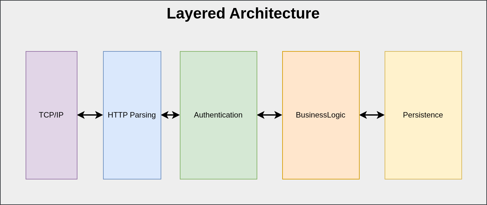
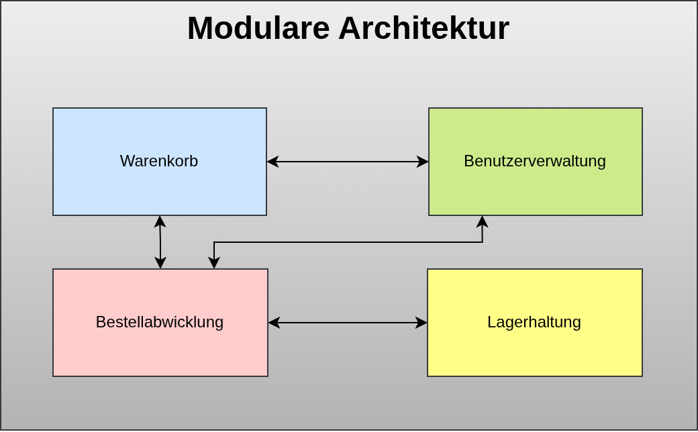
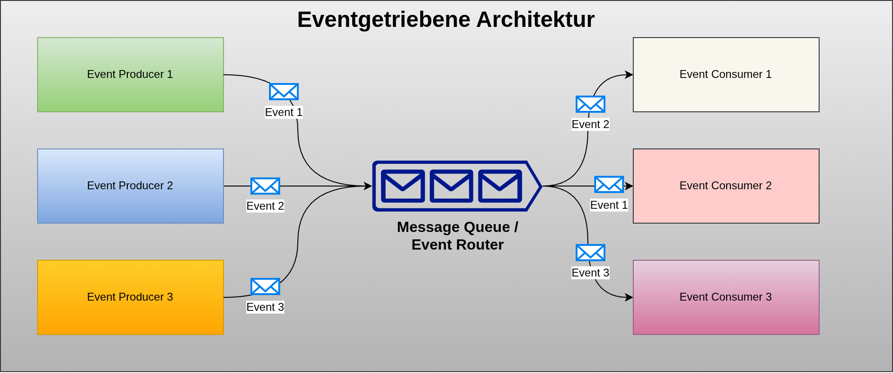

<!-- _class: lead -->

# Software Architektur
## Software Engineering
## Sven Eppler

---

# Was ist das?
- Beschreibt den High-Level Aufbau der Software
    - Welche Komponenten und Module gibt es?
    - Welche Abhängigkeiten haben diese untereinander?
- Ziel: Erzeugen einer "sinnvollen" Struktur
    - Verantwortlichkeiten klären
    - Vermeiden von Spaghetti-Code
    - Erkennen von Risiken/Komplexität

---

<!-- _class: chapter -->

# Arten von Softwarearchitektur

---

# Der Monolith 1/2

- Das gesamte Programm ist in einer einzelnen ausführbaren Datei
- Der Quellcode kann trotzdem sinnvoll strukturiert sein und verschiedene Module nutzen
- Schlechtfall: Big ball of mud
    - Beliebige Teile der Software greifen auf beliebige andere Teile zu
- Updates müssen auf dem Zielsystem eingespielt werden

---

# Der Monolith 2/2

- Gilt mittlerweile fast schon als "anti pattern"
    - Hat definitiv aber Vorteile bei kleinen / mittleren Projekten
- Geringe Komplexität
- Schlechte Skalierbarkeit
- Beispiele: MS Word, Photoshop, Linux-Kernel

---

# Client-Server Architektur 1/2
- Die Anwendung ist fundamental aufgespalten in eine Client- und eine Serverseite
    - Der Client ist typischerweise für die Anzeige verantwortlich
    - Der Server liefert die Daten und Verarbeitung der Daten
- Datenaustausch zwischen Client und Server findet i.d.R. via Netzwerk statt
- Updates können zum Teil rein Serverseitig durchgeführt werden.
    - Änderungen am Client müssen natürlich auf dem Zielsystem erfolgen (Ausnahme: WebAnwendungen)

---

# Client-Server Architektur 2/2

- Mittlere Komplexität
- Gute Skalierbarkeit
- Beispiele: Typische WebAnwendungen, Business-Anwendungen bei denen das Frontend direkt mit der Datenbank spricht, Email-Client & Email-Server

---

# Verteilte Architektur 1/2
- Dabei werden wichtige Komponenten der Anwendung als eigene Prozesse ausgelagert
- Kommunikation zwischen den Komponenten findet dann nicht mehr "direkt" via Funktionsaufruf statt
    - IPC (InterProcessCommunication) z.B. mit MessageQueues, SharedMemory oder Dateien
    - RPC (RemoteProcedureCalls) via Netzwerk z.B. gRPC
    - HTTP API basiert

---

# Verteilte Architektur 2/2

- Hohe Komplexität um das Zusammenspiel der einzelnen Anwendungen sicher zu stellen
- Hohe Skalierbarkeit, da jede Anwendung für sich skalieren kann
- Updates erfordern i.d.R. konsens über das gesamte System
    - Z.B. IoT Systeme mit Sensoren "in the wild" (Arktis, Öltanker, etc.)
- Beispiele: Netflix, Amazon, DB Systems

---

# "Weiche" Architektur Arten

Dabei handelt es sich nicht um "standalone" Konzepte, wie Software Strukturiert werden kann.

Sondern um Ideen die genauso z.B. in einer Verteilten wie monolithischen Softwarearchitektur zum Einsatz kommen könnten.

---

# Layered Architektur

- Die Komponenten der Software werden in Schichten aufgeteilt
    - Z.B. Kommunikations-Schicht, Business-Logik-Schicht, Kompatibilitäts-Schicht
    - Schichten dürfen nur mit ihren direkten "Nachbarn" kommunizieren und Daten austauschen
- Beispiele: OSI Schichtenmodell, DomainDrivenDesign, Middlewares in HTTP-Frameworks

---
# Layered Architektur

---

# Modulare Architektur
- Die Software wird in Module zerlegt
    - Diese Module werden dann zum Teil sogar unabhängig voneinander entwickelt
    - Dadurch kann das selbe Modul auch in verschiedenen Softwareprojekten eingesetzt werden
- Über die Module werden auch Sichtbarkeiten/Abhängigkeiten definiert
- Vorteile:
    - Wiederverwendbarkeit, Austauschbarkeit, klare Verantwortlichkeiten, klare Kommunikationspfade
- Nachteile:
    - Kann zu Spaghetticode führen

---

# Modulare Architektur

---

# Ereignisgetriebene Architektur
- Das System "wartet" auf Ereignisse auf diese es dann reagiert
- Das System kann auch selbst notwendige Ereignisse erzeugen
- Resourcenschonend, da Polling verhindert wird
- Vorteile:
    - Leichtgewichtig, erzeugt geringe Grundlast, lose Kopplung, Flexibel und Erweiterbar
- Nachteile:
    - Eventual Consistency, höhere Komplexität, nicht immer klar "wer macht was?"
- Beispiele: EventSourcing, Mqtt, IoT (Sensoren)

---

# Ereignisgetriebene Architektur

