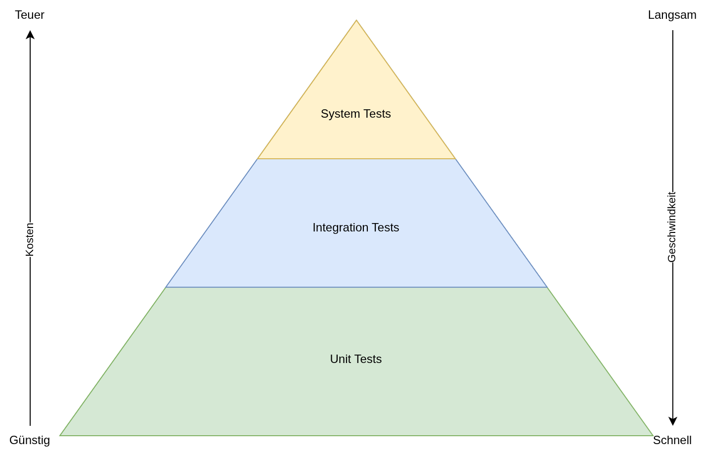
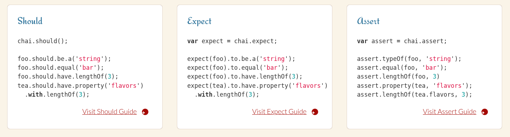

<!-- _class: lead -->

# Testing
## Software Engineering
## Sven Eppler


---

<!-- _class: chapter -->

# Warum Testen?
## Ich mache keine Fehler. :)


---

# Warum Testen

Menschen machen Fehler (KI-Assistenten halluzinieren). Beide schreiben Code, entsprechend ist Code auch immer mit Fehlern behaftet.

Software Tests sollen:
- Korrektheit sicherstellen
- Verhalten festzurren
- Können schlechtes Design offenbaren

---

# Manuelles Testen

Beim manuellen Testen wird durch einen Menschen händisch die Software getestet.

Tester können sein:
- Der Entwickler
- Ein Tester
- Der Kunde 😀

Problem: Wenn Menschen/KIs den Code bei Code Fehler machen, machen sie es beim Testen ebenfalls.

---

# Manuelles Testen

Manuelles Tests sind aber auch langsam, ermüdend.
Des weiteren ist ab einer bestimmten Komplexität der Software manuelles Testen schlicht nicht mehr möglich.

Beispiel: Kombinatorische Explosion in Word:
- Font: Arial, Schrftgröße: 24pt, Farbe: Blau, Unterstriche+Kursiv+Fett
- Font: TimesNewRoman, Schriftgröße 32pt, Farbe: Grün, Schatten
- Font: ComicSans, Schriftgröße 240pt, Farbe: Weiß, auf weißem Hintergrund
- ...

Es gibt unendlich viele Kombinationen die Fehler/Abstürze erzeugen könnten.

---

# Automatisiertes Testen

Mithilfe von automatisierten Tests werden die Probleme des manuellen Testens umgangen:
- Schnell: Es können viele Tests pro Sekunde durchgeführt werden
- Zuverlässig: Es werden keine Testfälle einfach "vergessen"
- Reproduzierbar: Die immer gleichen Tests werden auch immer gleich ausgeführt

Des weiteren kann ein automatisierter Test auch auf unterschiedlichen Sytemen/Plattformen ausgeführt werden. Damit wird das _works on my machine_ Problem umgangen.

---

<!-- _class: chapter -->

# Testarten
## Was gibts denn alles?

---

# Unit Tests

Unit Tests bilden die Basis für Softwaretests.

- Schnell ausführbar
- Einfach zu implmentieren
- Decken sämtliche edge-cases ab
- Viele kleine, fein granulierte Tests 

Ein einzelner Unit Tests deckt typischerweise eine bestimmten Aspekt einer einzelnen Funktion/Methode ab.
Eine Gruppe von UnitTests deckt dann die Funktionalität einer gesamten Klasse ab.

---

# Integration Tests

Integration Tests sind aufwändiger als Unit Tests. Integration Tests sollen das Zusammenspiel mehrere Komponenten (Klassen, Methode, etc.) miteinander sicherstellen.

- Mittel schnell asuführbar
- Einfach bis Mittel aufwändig zu implementieren
- Decken nur noch wenige edge-cases ab
- Weniger, dafür aufwändigere Tests

Mehrere Klassen/Module die miteinander interagieren werden in einem Integration Tests auf kompatiblität überprüft.

---

# System Tests (End-to-End Tests)

System Tests übrprüfen die Funktionalität eines gesamten System inklusive aller externen Abhängigkeite (z.B. Datenbanken, externe Dienste, etc.)

- Langsam ausführbar
- Aufwändig zu implementieren
- Decken meist nur noch den happy-path ab
- Sehr wenige, dafür "Mission Critical" tests

Das Gesamtsystem muss automatisiert gestartet und getestet werden, dazu sind meist auch entsprechende Orchestrierungstools notwendig.

Automatisieren von System Tests ist zeitaufwändig.

---

# Weitere Testarten
 Unit-, Integration- und SystemTests decken 90% des üblichen Testbedarfs ab. Darüber hinaus gibt es noch andere Testarten:

- Smoke Tests
Einfach mal starten und schauen, ob es gleicht "crasht"
- Performance Tests
Ist die Anwendung schnell genug?
- Security Tests
Sind bekannte Sicherheitsprobleme abgedeckt?

---

# Weitere Testarten

- Acceptance Tests
Sind die Akzeptanzkriterien (Funktionale und nicht Funtkaionale) erfüllt
- Usability Tests
Ist die Anwendung nutzbar/ergonomisch
- Regression Tests
Sind alle Features die "gestern" nocht gingen heute auch noch gut?
- Stress Testing
Wie verhält sich das System an der Lastgrenze?
- Mutation Testing
Der Code wird "mutiert" und es wird überprüft, ob anschließend Tests fehlschlagen. Soll Lücken in der Testabdeckung identifizieren.

---

<!-- _class: image-only -->

# Testpyramide



---

# Test Driven Development (TDD)

Bei TDD beginnt die Entwicklung mit den Tests.

Wenn die Tests geschrieben sind (die alle fehlschlagen), wird nach und nach die Fuktionalität implementiert bis alle Tests erfolgreich durchlaufen.

- Sinvoll für kleinere Klassen um ein Gefühl für die Verwendung der Klasse zu bekommen
(Welche Methoden, welche Paramter, etc. pp.)
- Erfordert viel Erfahrung, da keinerlei IDE Unterstützung 
(Schließlich schreibt Code der Klassen und Methoden nutzt, die noch nicht existieren)
- Hilft bei der Strukturierung der Interfaces und Abhängigkeiten

---

# Testspezifikation / Testplan

In größeren Softwareprojekten ist es üblich, dass für einzelne Komponenten, Teilsysteme oder das ganze System formell erfasst wird, was und wie zu testen ist.

Die zu testenden Fällen im Unit-Test sind meißt offensichtlich. Im Bereich der Integration- und SystemTests macht es durchaus Sinn, die geforderten Testfälle klar zu spezifizieren.

Hier kommen i.d.R. dedizierte Test-Ingenieure und der Software-Architekt zum Einsatz um z.B. kritische Abschnitte zu identifizieren.


---

# Testspezifikation / Testplan

Sofern entsprechende Spezifikationen existieren, ist es auch wichtig die bestehenden Tests gegen diese Sepzifikation abzugleichen.

Aus diesem Bedarf sind auch spezielle Test-Syntaxen entstanden wie z.B. Behavior-Driven-Design oder Fluent-Assertions.

Je "untechnischer" der Testcode, umso einfacher ist er auch für nicht-Entwickler auf Einhaltung der Testspezifikation zu überprüfen.

---

# Testabdeckung / Code Coverage

Die Testabdeckung beschreibt, welche Teile der Anwendung durchlaufen wurden bei einem Testdurchlauf.

Diese Information kann visualisiert werden um zu sehen, welche Zeilen im Quellcode von keinem Test durchlaufen werden. Für diese Stellen können dann weitere Tests geschrieben werden.

Theoretisch ist so eine Testabdeckung von 100% möglich. Diese ist aber aus wirtschaftlichen und zum Teil aus technischen Gründen nicht erreichbar. Eine Abdeckung von 90% und mehr gilt als "vollständig".

---

<!-- _class: image-only -->

# Testabdeckung / Code Coverage

Außerdem gibt diese Metrik ein trügerisches Bild: Code der zu 100% "abgedeckt" ist, muss nicht Fehlerfrei sein:

```javascript
function divide(a, b) {
    return a/b;
}

// Test, erzeugt 100% Testabdeckung
describe("divide function", () => {
	it("divides 1 by 1", () => {
		const result = divide(1, 1);
		assert.equal(result, 1);
	});
});

// Was ist mit:
// divide(1,0);
```

---

# Fluent API Assertions

Eine "Fluent API" ist ein Pogrammierkonzept, bei dem jede Method einer Klasse eine Referenz auf `this` zurück gibt. Dadurch können die Funktionsaufrufe ge-chained werden.

Insbesondere für Validierung kann das sehr "natürlichsprachlichen" Code erzeugen.

Beispiel: [Chai Assertion Library](https://www.chaijs.com)


---

<!-- _class: chapter -->

# Fazit
## Und nun?

---

# Fazit

- Softwaretests sind aus meiner Sicht das wichtigste Tool für qualitativ hochwertigen Code
- Nur so kann kontinuirlich sichergestellt werden, dass alles funktioniert wie gewünscht
- Und auch nicht "aus versehen" Features aus der Vergangenheit kaputt gemacht werden
- Ist die Testsuite hinreichend ausgeprägt, kann nach einem erfolgreichen Testlauf quasi "blind" released werden

