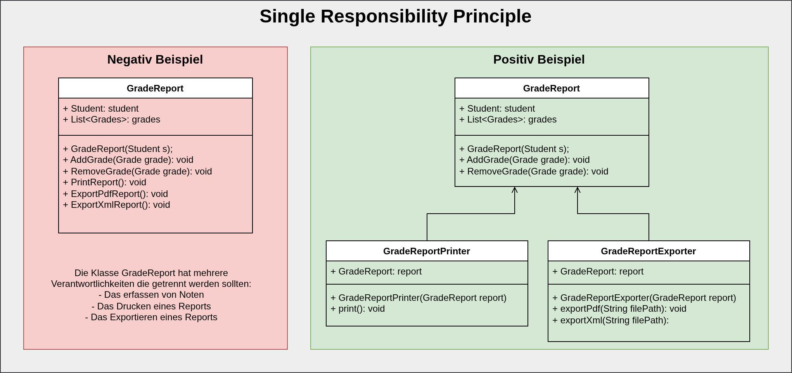
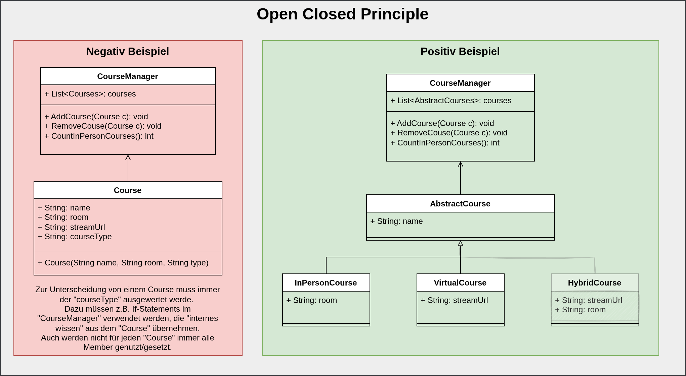
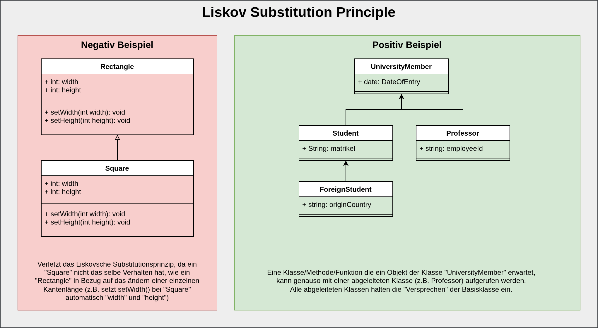
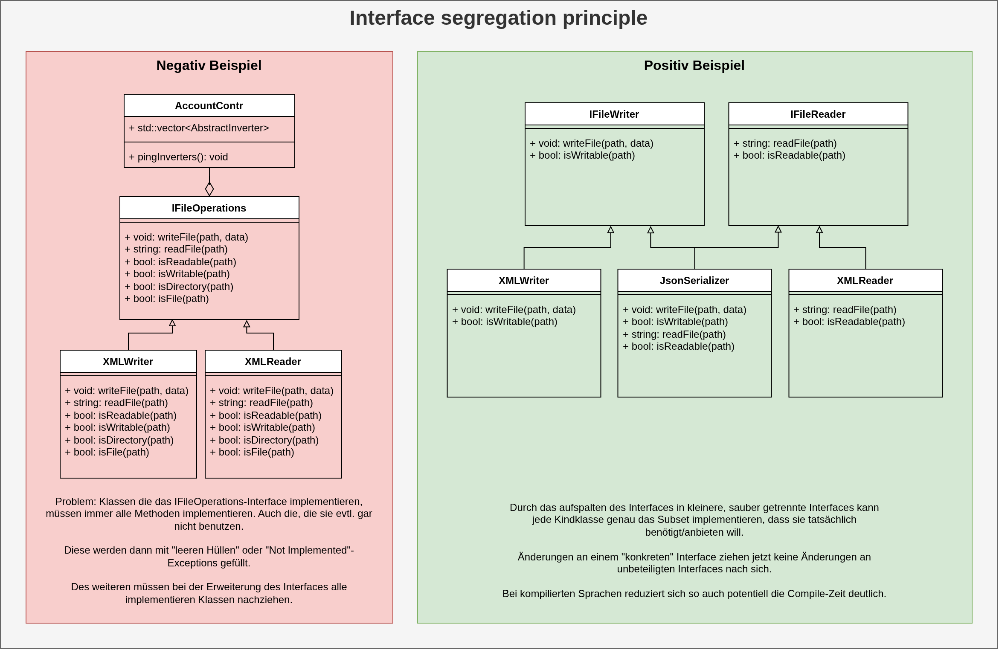
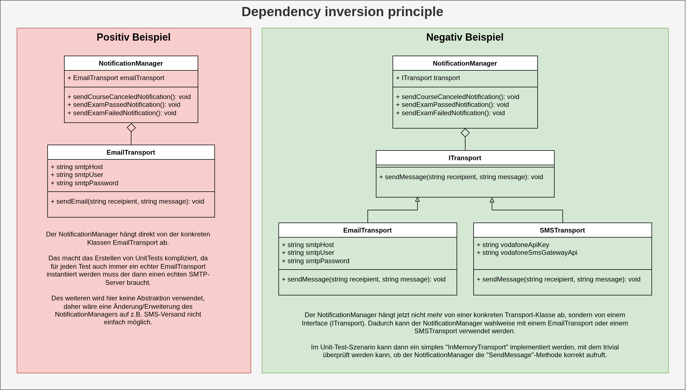
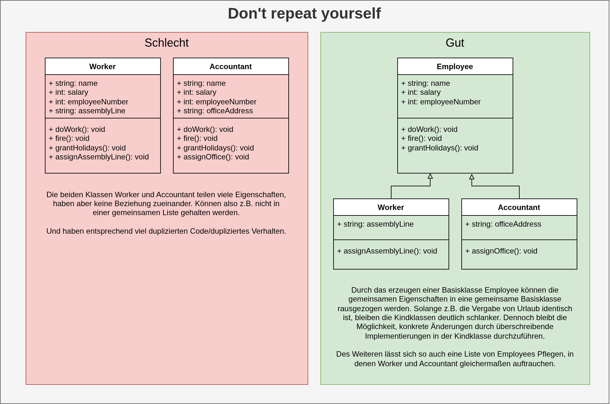

<!-- _class: lead -->

# Design Principles
## Software Engineering
## Sven Eppler


---

# Was sind Design Principles?

- **Richtlinien**, keine starren Regeln
- Abstraktion von **Best Practices**
- Sprachrohr für bewährte Problemlösungen
- Fokus auf **Wartbarkeit** und **Verständlichkeit**
    - Stichwort: Technical Debt (Technische Schulden)

---

# Warum sind sie wichtig?

- **Beherrschbarkeit von Komplexität**: Software wächst, Prinzipien halten sie strukturiert.
- **Team-Alignment**: Gemeinsames Verständnis davon, wie "guter Code" aussieht.
- **Nachhaltigkeit**: Reduzierung von Technical Debt (technische Schulden).
- **Flexibilität**: Erleichtert spätere Änderungen und Erweiterungen.

---

# Wo und wie helfen sie?

- **In der Design-Phase**: Als Kompass für die Architektur.
- **Beim Refactoring**: Zielzustand für Code-Verbesserungen.
- **In Code-Reviews**: Objektive Diskussionsgrundlage statt "Bauchgefühl".
- **Fehlersuche**: Einhalten von Prinzipien reduziert oft die Fehleranfälligkeit.

---

<!-- _class: chapter -->

# SOLID

---

# SOLID: Die fünf Prinzipien

- **S**ingle Responsibility: Eine Klasse/Modul sollte nur **einen** Grund zur Änderung haben.
- **O**pen/Closed: Software-Einheiten sollen offen für **Erweiterungen**, aber geschlossen für **Modifikationen** sein.
- **L**iskov Substitution: Unterklassen müssen ihre Basisklassen **ersetzen** können, ohne das Verhalten zu ändern.
- **I**nterface Segregation: Viele **spezifische** Interfaces sind besser als ein allgemeines "Fat Interface".
- **D**ependency Inversion: Abhängigkeiten von **Abstraktionen** (Interfaces), nicht von konkreten Implementierungen.

---

<!-- _class: image-only -->

# Single Responsibility Principle

> there should never be more than one reason for a class to change.



---

# Open/Closed Principle

> software entities should be open for extension, but closed for modification.

---
<!-- _class: image-only -->



---

# Liskov Substitution Principle

> objects in a program should be replaceable with instances of their subtypes without altering the correctness of that program.

---
<!-- _class: image-only -->



---

# Interface Segregation Principle

> many client-specific interfaces are better than one general-purpose interface.

---
<!-- _class: image-only -->



---

# Dependency Inversion Principle

> high-level modules should not depend on low-level modules. Both should depend on abstractions.

---
<!-- _class: image-only -->



---

<!-- _class: chapter -->

# DRY
## Dont Repeat Yourself

---

# Was ist DRY?

- Das DRY Theorem versucht zu verhindern, dass bestimmte Informationen mehrfach in der selben Codebase vorkommen.
- Dabei zielt es nicht einzig auf duplizierten Code ab, sondern auf evtl. nicht sauber ausdefinierte Vererbungshierachien
- Generell gilt:
  - Was gleich ist, sollte als gleich behandelt werden und nur einmal implementiert werden.
  - Was nicht gleich ist, sollte nicht mit Druck durch DRY gleich gemacht werden.

---

<!-- _class: image-only -->

# DRY im Kontext von OOP



---
# DRY in Funktionen (Negativbeispiel)

```javascript
function processOrder(items) {
  const subtotal = items.reduce((sum, item) => sum + item.price, 0);
  // Hartcodierte Steuerberechnung
  const tax = subtotal * 0.19; 
  const total = subtotal + tax;
  console.log(`Bestellung abgeschlossen: ${total}€`);
}

function processReturn(items) {
  const subtotal = items.reduce((sum, item) => sum + item.price, 0);
  // Logik hier dupliziert
  const tax = subtotal * 0.19; 
  const total = subtotal + tax;
  console.log(`Retoure erstattet: ${total}€`);
}
```

Berechnung der MwSt bei Bestellung und Retoure ist dupliziert.

---

# DRY in Funktionen (Positivbeispiel)

```javascript
const VAT_RATE = 0.19;

function calculateVAT(amount) {
  return amount * VAT_RATE;
}
function processOrder(items) {
  const subtotal = items.reduce((sum, item) => sum + item.price, 0);
  const total = subtotal + calculateVAT(subtotal);
  console.log(`Bestellung abgeschlossen: ${total}€`);
}
function processReturn(items) {
  const subtotal = items.reduce((sum, item) => sum + item.price, 0);
  const total = subtotal + calculateVAT(subtotal);
  console.log(`Retoure erstattet: ${total}€`);
}
```

MwSt Berechnung als eigene Funktion ausgelagert.

---

# Wann ist WET besser als DRY?

WET (**W**rite **E**verything **T**wice) kann sinnvoll sein:

- **Unit Tests**: Deduplizierung von Test Code ist oft nicht sinnvoll.
- **Premature Abstraction**: Zu frühe Abstraktion ist oft komplexer als Duplizierung.
- **Coupling (Kopplung)**: Gemeinsame Abstraktionen erzeugen Abhängigkeiten. Wenn sich die Anwendungsfälle auseinanderentwickeln, wird die Abstraktion starr.
- **Lesbarkeit**: *"Duplication is far cheaper than the wrong abstraction"* (Sandi Metz).
- **Rule of Three**: Erst beim dritten Mal über ein Refactoring nachdenken.
---

<!-- _class: chapter -->

# KISS
## Keep it simple, stupid

---


- **Einfachheit** ist das oberste Ziel.
- Komplexität vermeiden, wo sie nicht zwingend notwendig ist.
- **Warum?**
  - Leichter zu verstehen.
  - Leichter zu testen.
  - Weniger anfällig für Bugs.
  - Günstiger in der Wartung.

---

# KISS (Negativbeispiel: Over-Engineering)

```javascript
// Unnötig komplexe Validierung für eine positive Ganzzahl
class ValidationStrategy {
  validate(value) { throw new Error("Not implemented"); }
}

class PositiveIntegerValidation extends ValidationStrategy {
  validate(value) {
    const regex = /^\d+$/;
    return typeof value === 'number' && Number.isInteger(value) && 
           value > 0 && regex.test(value.toString());
  }
}

const validator = new PositiveIntegerValidation();
if (validator.validate(42)) { /* ... */ }
```

---

# KISS (Positivbeispiel: Einfachheit)

```javascript
// Direkte, lesbare Lösung
function isPositiveInteger(value) {
  return Number.isInteger(value) && value > 0;
}

if (isPositiveInteger(42)) { /* ... */ }
```

---
<!-- _class: chapter -->

# YAGNI
## You Ain't Gonna Need It

---

# YAGNI

- **YAGNI** ist ein Prinzip, das besagt, dass man nicht implementieren soll, was man noch nicht braucht
- Insbesondere als Neuling neigt man zu OverEngineering, dabei sind simple Lösungen oft genug (siehe KISS)

---

<!-- _class: chapter -->

# Clean Code
## Wir schreiben Code für Menschen, nicht für Computer

---

# Clean Code

- Clean Code findet auf der "Meta" Ebene statt. Technisch ist es problemlos möglich mit absolutem "dirty code" korrekte und voll funktionsfähige Software zu schreiben
- Clean Code zielt daher auf Verständlichkeit und Wartbarkeit von Software ab
- Der Quellcode der geschrieben wird, soll nicht nur valide für den Compiler sein, sondern auch für Menschen verstehbar beschreiben, was passieren soll
- Reduzierung der "cognitive load"
- Geht zurück auf Robert C. Martin

---
# Clean Code - Kognitive Last

- Das Konzept kommt aus der Psychologie und beschreibt die Belastung unseres Arbeitsgedächtnis
- Unterteilt wird kognitive Last in drei Bereiche: intrinsische, Extraneous, Germane Belastung
- Arbeiten wir unter hoher kognitiver Last kommt es unwillkürlich zu Fehlern/Fehlentscheidungen
- Reduzieren der kognitiven Last verringert also grundsätzlich die Fehleranfälligkeit unserer Handlungen

---

# Clean Code - Sprechende Bezeichner

> there are only two hard problems in programming: Cache invalidation and naming things

- Bezeichner sind für uns Menschen, die CPU interessiert sich nicht für Funktionsnamen
- Manchmal ist es ein Indiz für zu große Funktionen/Methoden/Klassen wenn dafür kein sprechender Name gefunden werden kann
- Abkürzungen sollen vermieden werden
    - Lange Bezeichner sind dank fuzzy-auto-complete kaum problematisch
- Fachlichkeit über Technik

---
<!-- _class: code-split -->
# Clean Code - Sprechende Bezeichner

```javascript
function check(x) {
  if (x > 18) {
    return true;
  } else {
    return false;
  }
}
```

```javascript
function isAdult(age) {
  const legalAge = 18;
  return age >= legalAge;
}
```

---
<!-- _class: code-split -->

# Clean Code - Magic Numbers

- Magische Nummern immer mithilfe von Variablen/Konstanten benennen.

```c
// ????
configureGpioPin(12, 136);

```

```c
// Aha!
const LED_PIN = 12;
const LED_INTENSITY = 136;
configureGpioPin(LED_PIN, LED_INTENSITY);
```

---

# Clean Code - Return early

- Der "Hauptpfad" einer Funktion/Methode beschäftigt sich mit dem "happy path"
- Edge-Cases werden gesondert geprüft und beenden die Funktion/Methode vorzeitig (return early)
- Reduziert kognitive last
- Verhindert tiefe Verschachtelungsebenen

---
<!-- _class: code-split -->
# Clean Code - Return early

```javascript
function isEqual(rectangle) {
  if (rectangle.width === this.width) {
    if (rectangle.height === this.height) {
      return true;
    }
    else {
      return false;
    }
  }
  else {
    return false;
  }
}
```

```javascript
function isEqual(rectangle) {
  if (rectangle.width !== this.width) {
    return false;
  }

  if (rectangle.height !== this.height) {
    return false;
  }

  return true;
}
```

---

# Clean Code - Bedingungen rausziehen

- Bedingungen in if-Statements sind oft schwer lesbar/verstehbar
- Erzeugen häufig große kognitive Last weil boolsche Operatoren (und, oder) sowie Klammersetzung eine Rolle spielen
- Insbesondere negierte Bedingungen sind für Menschen schwerer zu verstehen

---

# Clean Code - Bedingungen rausziehen

```javascript
const BLOG_MODERATOR = 1;
const BLOG_ADMINISTRATOR = 2;

function canEditPost(post, user) {
  const isOwner = post.ownerId === user.id;
  const isModerator = user.role === BLOG_MODERATOR;
  const isAdmin = user.role === BLOG_ADMINISTRATOR;

  const canEdit = isOwner || isModerator || isAdmin;

  return canEdit;

/* Statt:
if(post.ownerId === user.id || (user.role === BLOG_MODERATOR || user.role === BLOG_ADMINISTRATOR)) {
    ...
}
*/
}
```

---

# Clean Code - Kurze Funktionen/Methoden

- Funktionen/Methoden sollte möglichst kurz sein
  - Es gibt nur zu lange Funktionen, keine zu kurzen
- Was ist eine zu lange Funktion/Methode? Definitionssache.
- Eine klare Aufgabe pro Funktion/Method, passend zum Namen

---

# Clean Code - Kommentare

- Am besten gar keine, weil der Code selbst aussagekräftig genug sein sollte
- Wenn man Kommentare nutzt, dann sollte der Kommentar das "Warum" erklären, nicht das "Was" beschreiben
- Erfahrung: Docu-Kommentare sind schnell outdated

---
<!-- _class: code-split -->

# Clean Code - Explizit statt Implizit

- Vermeiden von "Clever Code"
    - Dieser ist meist schwer verstehbar/wartbar
- Implizites Verhalten wird of als "magisch" bezeichnet
    - Wer die Magie nicht kennt, steht wie der Ochse vor dem Berg


---

<!-- _class: code-split -->

# Clean Code - Explizit statt Implizit

Daten von STDIN Zeilenweise einlesen und als Kleinbuchstaben ausgeben:
```perl
#!/usr/bin/perl
print lc while <>
```

```perl
#!/usr/bin/perl
while (<STDIN>) {
    my $loweCase = lc($_);
    print $loweCase;
}
```

---

# Boyscout Rule

- "Leave the campground cleaner than you found it"
- "Leave the codebase better than you found it"
- Unsauberen Code immer versuchen zu verbessern
    - Mindestens Fundstellen dokumentieren (Tickets)
