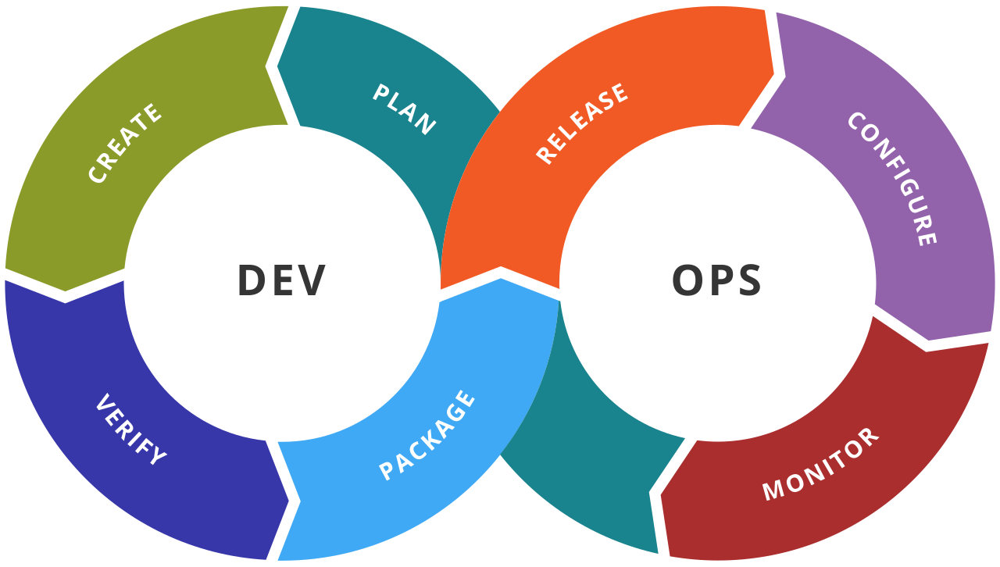
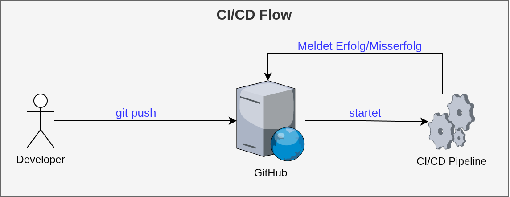

<!-- _class: lead -->

# Continious Integration / Continious Deployment
## Software Engineering
## Sven Eppler

---

<!-- _class: chapter -->

# Continious Integration
## Immer am Ball bleiben

---

# Continious Integration

- Beschreibt ein Verfahren, um bestimmte Aufgaben automatisch und kontinuierlich durchzuführen
    - Bauen des Projektes
    - Ausführen der Software-Tests
    - Linting / Static Code Analysis
    - Security Scanning
    - CVE / Dependency Scanning
    - ...
- Jede veröffentlichte Version im Repository durchläuft eine solche "CI-Pipeline"
---

# Continious Integration

- Wichtiger Eckpfeiler für Softwarequalität
- Verhindert/Reduziert sog. "broken commits"
- Sämtliche Aufgaben sollten i.d.R. auch lokal durchgeführt werden können
    - Menschen vergessen dies aber manchmal
    - Wichtig für debugging (warum failed das in der Pipeline?)
- Wird typischerweise durch die Repository-Hosting-Plattform "Zwangsausgeführt"
- Erfolgreicher durchlauf der CI-Pipeline i.d.R. Vorraussetzung zur Integration eines Merge-Requests
- Vermeiden von "works on my machine"

---

<!-- _class: chapter -->

# Continious Deployment
## Immer der neuste Ball draußen

---

# Continious Deployment

- Beschreibt ein Verfahren, um das Ausrollen einer neuen Software Version zu automatisieren
    - Ezeugen von MSI-Installern
    - Packen von Release-Archiven
    - Erzeugen von Changelogs
    - Ausrollen neuer Container-Images auf dem Staging/Integration/Production-System
    - ...

- Jeder veröffnetlichte Version im Repository durchläuft eine solche "CD-Pipeline"
---

# Continious Deployment

- Soll dem Team die Angst vor dem Release nehmen
- Führt jedes Release identisch durch
    - Keine "vergessenen" Schritte
- Vermeidet "Big Bang" Releases
- Vermeiden von "works on my machine" 
- Automatisiert den Prozess, verhindert dadurch Silo-Bildung / Single points of failure
    > Wir können diesen Freitag nicht releasen, Günther ist Krank!
- Nicht für jedes Projekt sinnvoll (z.B. manuell ausgerollte Kundenprojekte)

---

<!-- _class: chapter -->

# DevOps
## Entwicklung & Operation

---

<!-- _class: image-only -->

# DevOps

- Hebt die strikte Unterscheidung zwischen den Entwicklern und den Administratoren auf
- Durch bessere Kommunikation mit allen Beteiligten soll die Geschwindigkeit und Qualität der Softwareentwicklung verbessert werden
- Ist ein kontinuierlicher Prozess

---

# GitOps / DevSecOps

- Bauen auf dem selben Konzept auf wie DevOps
- GitOps: Über das git Repository wird alles gesteuert
    - Spezifikationen
    - Konfigurationen
    - Deployments
- DevSecOps: Erweiterung des DevOps um Securityrelvante Tätigkeiten
    - Entwickeln mit Security im Blick
    - Anwenden von Security Scannern, CVE Scanner, etc.

---

# Live Beispiel

- Beispiel-Repository: https://github.com/ghandmann/todo-backend

