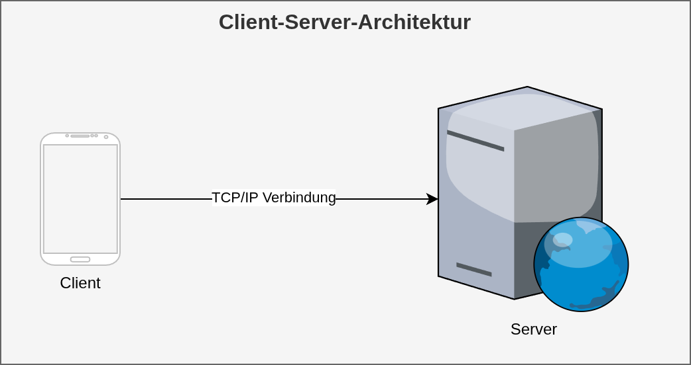

<!-- _class: lead -->

# Klausurvorbereitung
## Software Engineering
## Sven Eppler


---

# Software Engineering Klausurthemen

Eine Schnittmenge der hier genannten Themen wird bei der Klausur im Sommersemester 2025 abgefragt.

1. Versionskontrolle mit git
1. Programmierparadigmen
1. Softwarearchitektur
1. Testing
1. Container Virtualisierung
1. Design Principles & Clean Code
1. Continious Integration / Continious Deployment

---

# Hilfsmittel

Die Klausur wird als OpenBook Klausur stattfinden. Entsprechend sind alle analogen Aufschriebe, Ausdrucke der Folien sowie Bücher erlaubt.

Keine technische Hilfsmittel sind gestattet.

---

# Beispielfragen

Frage: Was macht das Kommando `git status`?

Antwort: Es liefert die aktuelle Statusinformation des git Repositories.
- Welche Dateien wurden geändert
- Welche noch nicht commited wurden
- Welche Konflikte bestehen
- Welche Vorschläge gibt es was als nächstes zu tun ist
- Welche Dateien aktuell in der staging area sind

---

# Beispielfragen

Frage: Was versteht man unter Datenkapsleung bei OOP?

Antwort: Daten und Methoden werden in Klassen gekapselt. Die Daten innerhalb der Klasse werden nur durch öffentliche Methoden verändert. Dadurch kann die Klasse die eigenen Daten immer in einem konsistenten Zustand halten.

---
<!-- _class: code-split -->

# Beispielaufgabe

Wenden Sie gängige CleanCode Regeln auf folgenden Code an:

```javascript
// Bad
function blubb(x) {
    if(x >= 18) {
        return true;
    }
    else {
        return false;
    }
}
```

```javascript
// Good
function isAdult(age) {
    const legalAge = 18;
    return age >= legalAge;
}
```
---

# Beispielaufgabe

- Skizzieren Sie eine typische Client-Server-Architektur



---

# Fragen?

- Noch irgendwelche offene Fragen zu den Themen?
- Sie können mich gerne via MS Teams noch fragen
    - Sofern die Antworten auf direkt gestellte Fragen für alle relevant sind, werde ich diese noch via MS Teams veröffentlichen